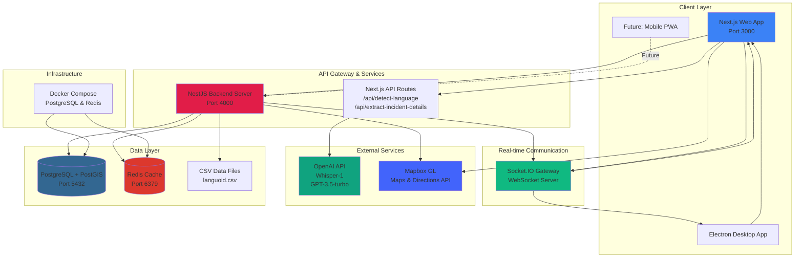
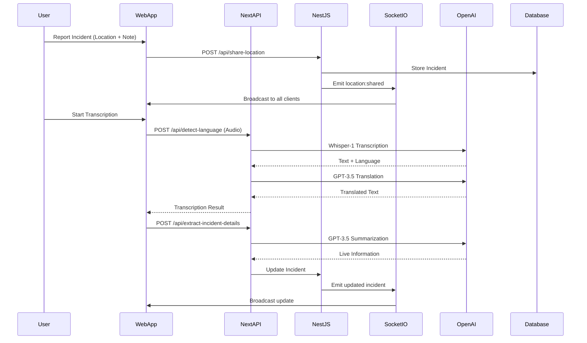
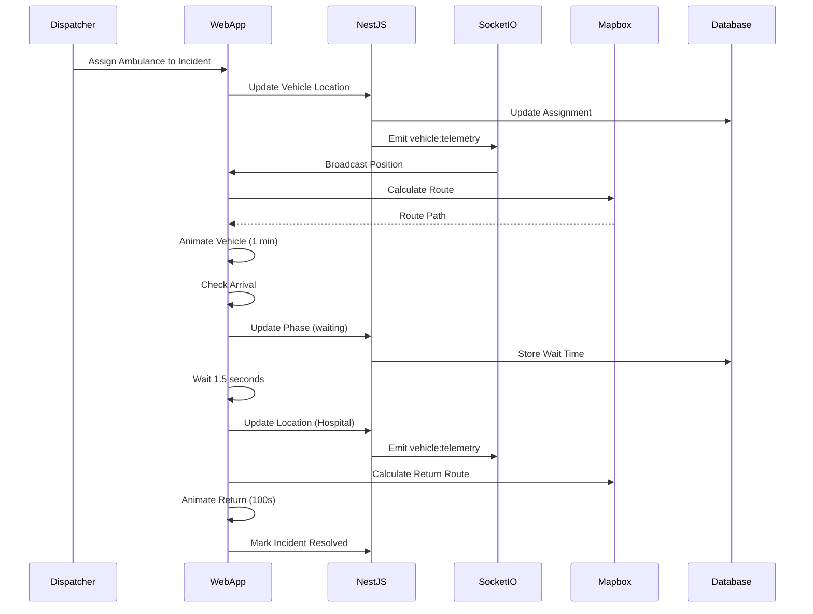
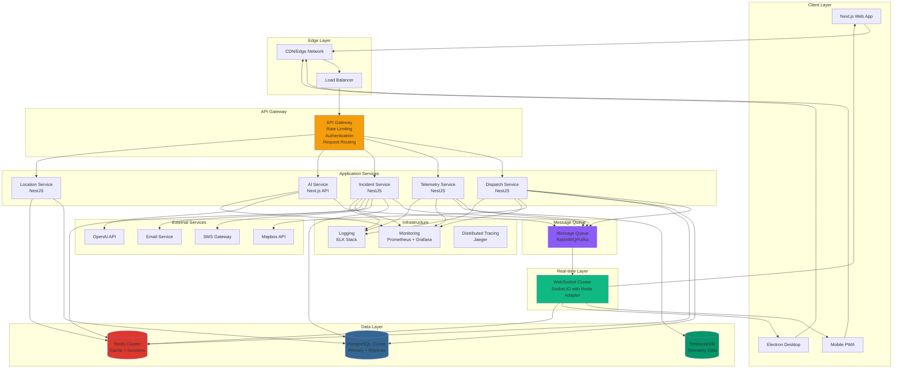
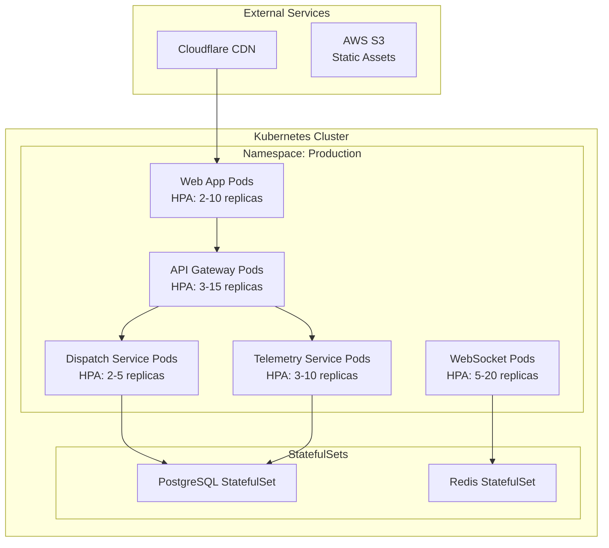

# Ambulance Uber - Architecture Documentation

## Current Architecture

### System Overview

Ambulance Uber is an Emergency Medical Services (EMS) dispatch system that provides real-time vehicle tracking, incident management, multilingual communication support, and intelligent dispatch capabilities. The system is built as a monorepo with multiple client applications and a centralized backend service.

### Architecture Diagram

### Component Breakdown

#### 1. Client Applications

**Next.js Web Application (`apps/@app/web`)**
- **Purpose**: Primary web interface for dispatchers and medical staff
- **Technology**: Next.js 14, React, TypeScript, Tailwind CSS
- **Key Features**:
  - Real-time map visualization with Mapbox GL
  - Vehicle tracking and management
  - Incident reporting and management
  - Live transcription interface
  - Medical mode for dispatchers
  - User mode for public incident reporting
- **API Routes**:
  - `/api/detect-language`: Audio transcription and language detection
  - `/api/extract-incident-details`: AI-powered incident detail extraction

**Electron Desktop Application (`apps/@app/electron`)**
- **Purpose**: Desktop wrapper for the web application
- **Technology**: Electron
- **Functionality**: Loads the web app in a native window

#### 2. Backend Services

**NestJS Server (`apps/@app/server`)**
- **Purpose**: Core backend API and business logic
- **Technology**: NestJS, TypeScript, TypeORM
- **Key Modules**:
  - **TelemetryGateway**: WebSocket server for real-time vehicle tracking
  - **VehicleController**: Vehicle CRUD operations
  - **MedicalController**: Medical vehicle management
  - **AEDController**: AED device management
  - **LocationsController**: Geographic point queries
- **Database Entities**:
  - `Vehicle`: Ambulance/vehicle information
  - `Dispatch`: Incident-ambulance assignments
  - `AED`: Automated External Defibrillator locations

**Socket.IO Gateway**
- **Purpose**: Real-time bidirectional communication
- **Events**:
  - `vehicle:telemetry`: Vehicle position updates
  - `location:shared`: Incident reports
- **State Management**: In-memory maps for vehicle positions and incidents

#### 3. Data Layer

**PostgreSQL with PostGIS**
- **Purpose**: Primary database for persistent data
- **Features**:
  - Geographic data types and queries
  - Vehicle, dispatch, and AED storage
  - Spatial indexing for location queries

**Redis**
- **Purpose**: Caching layer (currently configured but limited usage)
- **Potential Use**: Session management, rate limiting, real-time state caching

**CSV Data Files**
- **Purpose**: Pre-loaded geographic/language point data
- **Implementation**: KDBush spatial index for fast nearest-neighbor queries
- **Default**: `languoid.csv` (27,000+ language points)

#### 4. External Services

**OpenAI API**
- **Whisper-1**: Speech-to-text transcription with language detection
- **GPT-3.5-turbo**: 
  - Translation of transcribed text
  - Incident detail extraction and summarization

**Mapbox GL**
- **Maps**: Interactive map rendering
- **Directions API**: Route calculation for ambulances
- **Traffic Layer**: Real-time traffic visualization

### Data Flow

#### Incident Reporting Flow

#### Ambulance Dispatch Flow

### Current Architecture Strengths

1. **Real-time Communication**: Socket.IO provides efficient bidirectional communication
2. **Geographic Capabilities**: PostGIS enables spatial queries and operations
3. **AI Integration**: OpenAI services provide multilingual support and intelligent summarization
4. **Monorepo Structure**: Shared code and consistent tooling across applications
5. **Type Safety**: TypeScript throughout the stack
6. **Scalable Frontend**: Next.js with API routes for serverless functions

### Current Architecture Limitations

1. **State Management**: Heavy reliance on in-memory state in Socket.IO gateway (not persistent)
2. **No Message Queue**: Direct API calls without queuing for reliability
3. **Limited Caching**: Redis configured but underutilized
4. **No Load Balancing**: Single backend instance
5. **No API Gateway**: Direct client-to-service communication
6. **Database Synchronization**: Using `synchronize: true` (not production-ready)
7. **No Authentication/Authorization**: Missing security layer
8. **No Monitoring/Observability**: Limited logging and metrics
9. **Tight Coupling**: Frontend directly calls multiple services

---

## Ideal Architecture

### Recommended Architecture Diagram

### Ideal Architecture Components

#### 1. **API Gateway Layer**
- **Purpose**: Single entry point for all client requests
- **Features**:
  - Authentication & Authorization (JWT, OAuth2)
  - Rate limiting per user/endpoint
  - Request/response transformation
  - API versioning
  - Request routing to appropriate services
- **Technology**: Kong, AWS API Gateway, or custom NestJS gateway

#### 2. **Microservices Architecture**

**Dispatch Service**
- Incident management
- Ambulance assignment logic
- Dispatch optimization algorithms
- Business rules engine

**Telemetry Service**
- Vehicle position tracking
- Real-time location updates
- Historical trajectory storage
- Geofencing and alerts

**Incident Service**
- Incident lifecycle management
- Status tracking
- Notification management
- Incident analytics

**AI Service**
- Speech-to-text processing
- Language detection
- Translation services
- Incident summarization
- Natural language understanding

**Location Service**
- Geographic queries
- Nearest point calculations
- Route optimization
- Map data management

#### 3. **Message Queue System**
- **Purpose**: Decouple services and ensure reliable message delivery
- **Use Cases**:
  - Asynchronous incident processing
  - Event-driven architecture
  - Retry mechanisms for failed operations
  - Event sourcing for audit trails
- **Technology**: RabbitMQ, Apache Kafka, or AWS SQS

#### 4. **WebSocket Cluster**
- **Purpose**: Scalable real-time communication
- **Features**:
  - Redis adapter for horizontal scaling
  - Room-based message routing
  - Connection management
  - Heartbeat monitoring
- **Technology**: Socket.IO with Redis adapter

#### 5. **Enhanced Data Layer**

**PostgreSQL Cluster**
- Primary database for transactional data
- Read replicas for query scaling
- Automated backups
- Point-in-time recovery

**TimescaleDB**
- Time-series data for telemetry
- Efficient storage of vehicle positions
- Time-based queries and aggregations
- Retention policies

**Redis Cluster**
- Distributed caching
- Session management
- Real-time state sharing
- Rate limiting counters
- Pub/Sub for events

#### 6. **Observability Stack**

**Monitoring**
- Prometheus for metrics collection
- Grafana for visualization
- Custom dashboards for:
  - Vehicle tracking metrics
  - Incident response times
  - API performance
  - System health

**Logging**
- Centralized logging with ELK stack
- Structured logging (JSON)
- Log aggregation and search
- Alerting on errors

**Distributed Tracing**
- Request tracing across services
- Performance bottleneck identification
- Service dependency mapping

#### 7. **Security Enhancements**

- **Authentication**: OAuth2/OIDC with identity provider
- **Authorization**: Role-based access control (RBAC)
- **API Security**: Rate limiting, input validation, SQL injection prevention
- **Data Encryption**: TLS in transit, encryption at rest
- **Audit Logging**: All critical operations logged

#### 8. **Deployment Architecture**

### Migration Path

#### Phase 1: Foundation (Months 1-2)
1. Implement API Gateway
2. Add authentication/authorization
3. Set up message queue
4. Implement proper database migrations
5. Add comprehensive logging

#### Phase 2: Scalability (Months 3-4)
1. Split into microservices
2. Implement WebSocket clustering
3. Add Redis caching layer
4. Set up monitoring and alerting
5. Implement database read replicas

#### Phase 3: Optimization (Months 5-6)
1. Add TimescaleDB for telemetry
2. Implement distributed tracing
3. Optimize database queries
4. Add CDN for static assets
5. Implement auto-scaling

#### Phase 4: Advanced Features (Months 7+)
1. Machine learning for dispatch optimization
2. Predictive analytics
3. Advanced geofencing
4. Mobile app development
5. Integration with external EMS systems

### Key Architectural Principles

1. **Separation of Concerns**: Each service has a single responsibility
2. **Scalability**: Horizontal scaling capability for all services
3. **Reliability**: Message queues, retries, and circuit breakers
4. **Observability**: Comprehensive monitoring, logging, and tracing
5. **Security**: Defense in depth with multiple security layers
6. **Performance**: Caching, CDN, and optimized database queries
7. **Maintainability**: Clean code, documentation, and testing
8. **Resilience**: Graceful degradation and fault tolerance

---

## Technology Recommendations

### Current Stack (Keep)
- **NestJS**: Excellent for building scalable backend services
- **PostgreSQL + PostGIS**: Perfect for geographic data
- **Socket.IO**: Proven real-time communication
- **Next.js**: Great for full-stack React applications
- **TypeScript**: Type safety across the stack

### Additions for Ideal Architecture
- **Kong/AWS API Gateway**: API management
- **RabbitMQ/Kafka**: Message queuing
- **TimescaleDB**: Time-series data
- **Prometheus + Grafana**: Monitoring
- **ELK Stack**: Logging
- **Kubernetes**: Container orchestration
- **Docker**: Containerization
- **GitHub Actions/CI-CD**: Automated deployment

### Considerations
- **Cost**: Cloud services add operational costs
- **Complexity**: Microservices increase operational complexity
- **Team Size**: Microservices require larger teams
- **Start Small**: Begin with monolith, extract services as needed

---

## Conclusion

The current architecture provides a solid foundation for an EMS dispatch system with real-time capabilities and AI integration. The ideal architecture addresses scalability, reliability, and maintainability concerns while maintaining the strengths of the current system. The migration should be gradual, prioritizing the most critical improvements first.

